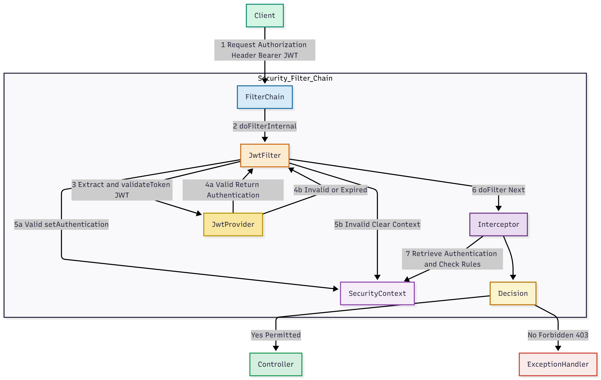
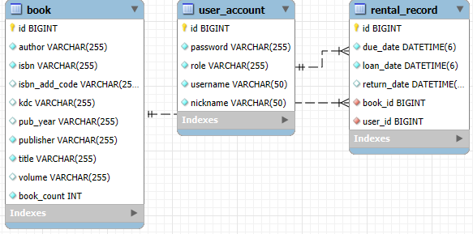

# 📚 NCH Library 소개

대학생 및 도서관 이용자들을 위한 **도서 관리 및 추천 서비스** 플랫폼입니다.  
도서의 등록, 검색, 대출/반납 기능을 제공하고, 나아가 **생성형 AI**를 통해 개인화된 도서 추천 경험을 제공합니다.

---

## 🎯 기획 의도 & 핵심 과제
* **통합 CRUD 관리:** 사용자(`User`) 및 관리자(`Admin`) 권한에 따른 도서 관리 기능 제공.
* **보안 및 확장성:** JWT(JSON Web Token)를 이용한 Stateless 인증/인가 시스템 구축.
* **사용자 친화적인 검색:** 제목, 저자, 출판사 등을 통합하거나 상세 조건으로 검색할 수 있는 기능 구현.
* **AI 기반 추천:** **생성형 AI API**를 활용하여 도서 목록 기반으로 사용자 쿼리에 맞는 도서 추천 기능 구현.
* **실시간 대출 관리:** 재고 수량 확인 및 대출/반납 기록을 관리하는 트랜잭션 구현.

---

## 📸 서비스 구현 화면

| 기능 번호 | 기능명 | 설명 | 스크린샷 |
| :---: | :---: | :--- | :---: |
| **1.** | **통합 검색** | 도서 제목, 저자, ISBN 등으로 한번에 검색하는 기능 |  |
| **2.** | **상세 검색** | 제목, 저자, 출판사, 발행 연도 등 상세 조건으로 검색하는 기능 |  |
| **3.** | **랜덤 추천 도서** | 사용자가 무작위 도서를 조회할 수 있는 기능 |  |
| **4.** | **AI 추천 도서** | Gemini API를 활용하여 사용자 쿼리 기반으로 책을 추천하는 기능 |  |
| **5.** | **도서 대출** | 사용자가 도서를 대출하는 기능 및 재고 관리 |  |
| **6.** | **도서 반납** | 대출한 도서를 반납 처리하고 반납일을 기록하는 기능 |  |
| **7.** | **관리자 페이지** | 도서 관리(CRUD) 및 사용자 관리 등 관리자 전용 기능 |  |

---

## 🛠 기술 스택

### **Backend**

-59666C?style=for-the-badge&logo=hibernate&logoColor=white)

### **Database**

### **External Services**
* **공공 데이터 :**   **도서관 정보나루(https://www.data4library.kr/)**  
 전국 공공도서관에서 수집한 회원·장서·대출 데이터 등을 제공하여
사서, 연구(기획)자, 민간사업자 등이 다양한 분석, 융합 콘텐츠 생산 및 새로운 서비스를 개발할 수 있도록 지원하는 서비스

---

##  주요 기능 및 특징

### 1. 인증 및 권한 관리 
* **JWT 기반 인증:** 로그인 성공 시 JWT 토큰을 발급하며, 세션을 사용하지 않는 **무상태(Stateless) 아키텍처**를 채택합니다.
* **토큰 검증 필터:** `JwtAuthenticationFilter`를 통해 모든 요청에 대해 토큰의 유효성을 검사하고 사용자 인증을 처리합니다.
* **Role 기반 인가:** 도서 등록, 수정, 삭제는 **`ROLE_ADMIN`** 권한만 허용됩니다.

### 2. 도서 관리
* **RESTful API:** `BookRestController`를 통해 CRUD 기능을 제공합니다.
* **통합 검색:** 제목, 저자, 출판사, ISBN에 대해 키워드를 사용한 통합 검색을 지원합니다.
* **상세 검색:** 제목, 저자, 출판사, 발행 연도를 조합하여 정밀한 검색이 가능합니다.

### 3. 대출 및 반납 관리 
* **대출 요청:** 도서의 `bookCount`(재고)를 확인하고 차감하며, 새로운 `RentalRecord`를 생성합니다. (트랜잭션 관리)
* **반납 처리:** `RentalRecord`의 `returnDate`를 기록하고 `bookCount`를 증가시킵니다.
* **내 대출 목록:** 현재 로그인한 사용자의 모든 대출 기록을 조회할 수 있습니다.

### 4. 생성형 AI  기반 도서 추천
* **AI 추천:** `GeminiService`에서 프로젝트에 등록된 도서 목록 데이터를 활용하여 Gemini API에 전달하고, 사용자 쿼리에 가장 적합한 도서를 추천합니다. 

---

## 💻 API Endpoints 

| 기능 분류 | HTTP Method | URL Path | 요구 권한 | 설명 |
| :---: | :---: | :---: | :---: | :--- |
| **인증** | `POST` | `/api/auth/login` | `permitAll` | 로그인 및 JWT 토큰 발급 |
| **사용자** | `POST` | `/api/users/register` | `permitAll` | 일반 사용자 회원가입 |
| **도서 조회** | `GET` | `/api/books` | `permitAll` | 전체 도서 조회 |
| **도서 검색** | `GET` | `/api/books/search/integrated` | `permitAll` | 통합 검색 |
| **도서 등록** | `POST` | `/api/books` | `ROLE_ADMIN` | 도서 신규 등록 |
| **도서 삭제** | `DELETE` | `/api/books/{id}` | `ROLE_ADMIN` | 도서 삭제 |
| **대출** | `POST` | `/api/rentals/rent/{bookId}` | `Authenticated` | 도서 대출 요청 |
| **반납** | `POST` | `/api/rentals/return/{rentalId}` | `Authenticated` | 도서 반납 요청 |
| **AI 추천** | `POST` | `/api/recommend` | `permitAll` | Gemini 기반 도서 추천 |

---
## 🔐 Spring Security Filter  

---
## 🛢️ ERD

---

## 🧑‍💻 개발자 

|  |
| :---: |
| **노찬희 (Roh Chanhee)** |
| **1인 개발 (Solo Developer)** |
| Frontend, Backend, AI, Infra, DB Modeling |
|  &nbsp;  |

