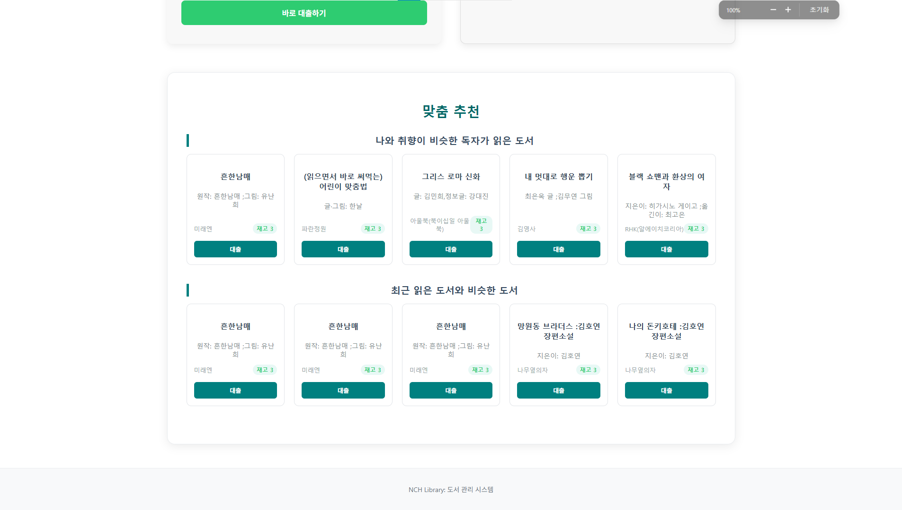
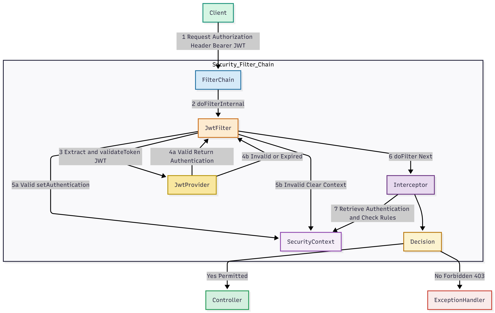
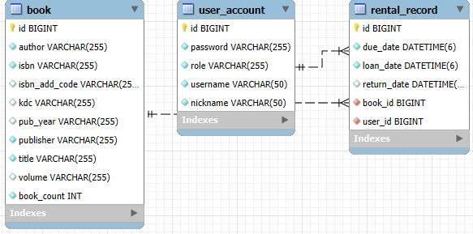

# 📚 NCH Library 소개

대학생 및 도서관 이용자들을 위한 **도서 관리 및 추천 서비스** 플랫폼입니다.  
도서의 등록, 검색, 대출/반납 기능을 제공하고, 나아가 생성형 AI(Gemini)와 **자체 개발한 벡터 유사도 알고리즘**을 통해 개인화된 도서 추천 경험을 제공합니다.

---

## 🎯 기획 의도 & 핵심 과제
* **통합 CRUD 관리:** 사용자(`User`) 및 관리자(`Admin`) 권한에 따른 도서 관리 기능 제공.
* **보안 및 확장성:** JWT(JSON Web Token)를 이용한 Stateless 인증/인가 시스템 구축.
* **고도화된 추천 알고리즘 구현:**
    * **통계 기반 추천:** 인기 도서, 급상승 트렌드, 신간 도서 등 대출 기록을 활용한 정렬 및 집계 시스템.
    * **유사도 기반 필터링:** **코사인 유사도(Cosine Similarity)**를 활용하여 사용자와 아이템 간의 방향성 일치도를 측정.
    * **생성형 AI:** Gemini API를 활용하여 도서 목록 기반으로 사용자 맞춤형 도서 추천.
* **실시간 대출 관리:** 재고 수량 확인 및 대출/반납 기록을 관리하는 트랜잭션 구현.

---

## 📸 서비스 구현 화면

| 기능 번호 | 기능명 | 설명 | 스크린샷 |
| :---: | :---: | :--- | :---: |
| **1.** | **통합 검색** | 도서 제목, 저자, ISBN 등으로 한번에 검색하는 기능 |  |
| **2.** | **상세 검색** | 제목, 저자, 출판사, 발행 연도 등 상세 조건으로 검색하는 기능 |  |
| **3.** | **통계/랜덤 추천** | 랜덤 추천 및 인기/급상승/신간 도서 추천 기능 |  |
| **4.** | **맞춤 추천** | **유사도 알고리즘** 기반 '이웃 독자 추천' 및 '취향 저격 도서' |  |
| **5.** | **AI 추천 도서** | Gemini API를 활용하여 사용자 쿼리 기반으로 책을 추천하는 기능 |  |
| **6.** | **도서 대출** | 사용자가 도서를 대출하는 기능 및 재고 관리 |  |
| **7.** | **도서 반납** | 대출한 도서를 반납 처리하고 반납일을 기록하는 기능 |  |
| **8.** | **관리자 페이지** | 도서 관리(CRUD) 및 사용자 관리 등 관리자 전용 기능 |  |

---

## 🛠 기술 스택

### **Backend**

-59666C?style=for-the-badge&logo=hibernate&logoColor=white)

### **Database**

### **External Services**
* **AI Model:** Google Gemini API
* **Open Data:** [도서관 정보나루](https://www.data4library.kr/) (전국 도서관 빅데이터 수집 서비스)

---

## 🚀 주요 기능 및 특징

### 1. 고도화된 추천 시스템 (Recommendation System)
단순 추천을 넘어 알고리즘 기반의 다각도 추천을 제공합니다.

* **통계 기반 추천 (Statistical):** 대출 기록을 SQL로 집계하여 **인기 도서**, **급상승/트렌드**, **최신 신간** 도서를 추출합니다.
* **유사도 기반 필터링 (Similarity-based):**
    * **알고리즘:** 코사인 유사도(Cosine Similarity)를 적용하여 두 벡터 사이의 각도를 측정, 취향 패턴의 일치도를 계산합니다.
    * **데이터 최적화:** 메모리 낭비를 줄이기 위해 One-hot 배열 대신 **Map 자료구조**를 사용해 0이 아닌 특징 정보만 효율적으로 저장하고 계산합니다.
    * **추천 방식:**
        * **이웃 사용자 기반:** 유사한 독서 취향을 가진 사용자(이웃)가 읽은 도서 중 내가 읽지 않은 도서를 추천.
        * **아이템 기반:** 내가 대출한 도서의 특징(저자, 출판사, KDC 등)과 가장 유사한 다른 도서를 추천.

### 2. 인증 및 권한 관리 
* **JWT 기반 인증:** 로그인 성공 시 JWT 토큰을 발급하며, Stateless 아키텍처를 통해 서버 확장성을 확보합니다.
* **권한 분리:** 일반 사용자는 대출/반납 및 맞춤 추천을 이용하며, 도서 등록 및 삭제 등 관리 기능은 `ROLE_ADMIN`에게만 허용됩니다.

### 3. 효율적인 도서 검색
* **통합 검색:** 제목, 저자, 출판사, ISBN 전체를 대상으로 하는 키워드 검색을 지원합니다.
* **상세 검색:** 특정 조건(제목, 저자, 출판사, 발행연도)을 조합하여 정밀한 결과를 도출합니다.

---

## 💻 API Endpoints 

| 기능 분류 | HTTP Method | URL Path | 요구 권한 | 설명 |
| :---: | :---: | :---: | :---: | :--- |
| **인증** | `POST` | `/api/auth/login` | `permitAll` | 로그인 및 JWT 토큰 발급 |
| **통계 추천** | `GET` | `/api/books/random` | `permitAll` | 인기/트렌드/신간/랜덤 도서 조회 |
| **맞춤 추천** | `GET` | `/api/recommend/user-based` | `Authenticated` | 이웃 사용자 기반 유사도 추천 |
| **맞춤 추천** | `GET` | `/api/recommend/item-based` | `Authenticated` | 아이템 기반 특징 유사도 추천 |
| **AI 추천** | `POST` | `/api/recommend` | `permitAll` | Gemini 기반 자연어 도서 추천 |
| **대출/반납** | `POST` | `/api/rentals/rent/{id}` | `Authenticated` | 도서 대출 및 트랜잭션 처리 |

---
## 🔐 Spring Security Filter  

---
## 🛢️ ERD

---

## 🧑‍💻 개발자 

|  |
| :---: |
| **노찬희 (Roh Chanhee)** |
| **1인 개발 (Solo Developer)** |
| Frontend, Backend, Recommendation Algorithm, DB Modeling |
|  &nbsp;  |